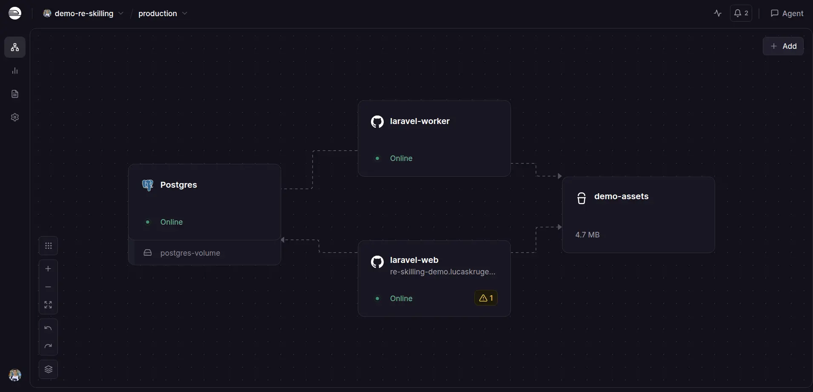

# Pipeline de análisis de voz — Demo

Demo interactiva de análisis de voz con IA. Graba respuestas a preguntas de entrevista, las transcribe con Gemini, analiza la prosodia y genera un informe PDF enviado por email.

## Stack

El stack es el mismo que usa Re-Skilling en producción:

- **Backend**: Laravel 13 (PHP 8.3) — API REST, jobs en cola, migraciones, Eloquent ORM
- **Frontend**: React 19 (JavaScript) — SPA sin build framework, Vite como bundler
- **Base de datos**: PostgreSQL 17 con extensión pgvector para búsqueda semántica (RAG)
- **Cola de trabajos**: Laravel Queue con driver `database`
- **IA**: Google Gemini 2.5 Flash — transcripción de audio y análisis prosódico
- **Email**: Resend (transport HTTP de Laravel, paquete `resend/resend-php`)
- **Storage**: AWS S3 en producción (Railway Object Storage), disco local en desarrollo
- **Deploy**: Railway
- **PDF**: DomPDF (barryvdh/laravel-dompdf)

## Arquitectura en Railway

Cuatro servicios en el mismo proyecto Railway:



| Servicio | Descripción |
|---|---|
| `laravel-web` | App principal — API + frontend compilado |
| `laravel-worker` | Procesa jobs de Gemini y generación de informes |
| `Postgres` | PostgreSQL 17 con pgvector, volumen persistente |
| `demo-assets` | Object Storage (S3-compatible) para audios y PDFs |

El dominio `re-skilling-demo.lucaskruger.com` apunta al servicio `laravel-web` mediante un **Custom Domain** configurado en Railway (Settings → Networking → Custom Domain). Se agrega un CNAME en el DNS de `lucaskruger.com` apuntando al dominio interno de Railway.

## Flujo del pipeline

```
Navegador (React SPA)
    │
    ▼
laravel-web (API)          ← sube audio a S3, crea sesión en Postgres
    │
    ▼ (encola jobs)
laravel-worker
    ├── ProcessInterviewAnswerJob  → lee audio de S3, llama a Gemini
    └── GenerateInterviewReportJob → genera informe + PDF en S3 + email
```

## Levantar en local

```bash
cp .env.example .env
# Completar GEMINI_API_KEY, RESEND_API_KEY en .env

docker compose up --build
```

La app queda en `http://localhost:8080`.

Para acceder desde el celular en la misma red WiFi, agregar al `.env`:

```
VITE_DEV_HOST=<tu-ip-local>   # ej: 192.168.0.100
```

## Variables de entorno clave

| Variable | Descripción |
|---|---|
| `GEMINI_API_KEY` | API key de Google AI Studio (gratis en aistudio.google.com) |
| `RESEND_API_KEY` | API key de Resend para emails |
| `MAIL_FROM_ADDRESS` | Dirección verificada en Resend (ej: `demo@tudominio.com`) |
| `DEMO_REPORTS_PASSWORD` | Contraseña para activar modo debug |
| `FILESYSTEM_DISK` | `local` en dev, `s3` en producción |

## Configurar emails con Resend

Se usa el transport HTTP de Resend (no SMTP, ya que Railway bloquea el puerto 587 saliente).

1. Crear cuenta en [resend.com](https://resend.com)
2. Ir a **Domains** → **Add Domain** → seguir los pasos de DNS para verificar el dominio
3. Crear una API key en **API Keys**
4. Setear en Railway (o `.env` local):

```
MAIL_MAILER=resend
RESEND_API_KEY=re_...
MAIL_FROM_ADDRESS=demo@tudominio.com
```

El paquete `resend/resend-php` y `symfony/http-client` ya están en `composer.json`.

## Dominio personalizado en Railway

Para mapear `re-skilling-demo.lucaskruger.com` al servicio `laravel-web`:

1. En Railway → servicio `laravel-web` → **Settings** → **Networking** → **Custom Domain**
2. Ingresar `re-skilling-demo.lucaskruger.com`
3. Railway muestra un valor CNAME (ej: `laravel-web-production.up.railway.app`)
4. En el panel DNS de `lucaskruger.com`, agregar:
   ```
   CNAME  re-skilling-demo  →  laravel-web-production.up.railway.app
   ```
5. Railway provisiona el certificado SSL automáticamente

## Modo debug

Ingresar la contraseña en el panel "Open debug" de la pantalla de selección de modo. Con debug activo se muestran las trazas internas de cada respuesta y el contexto recuperado en el informe.
